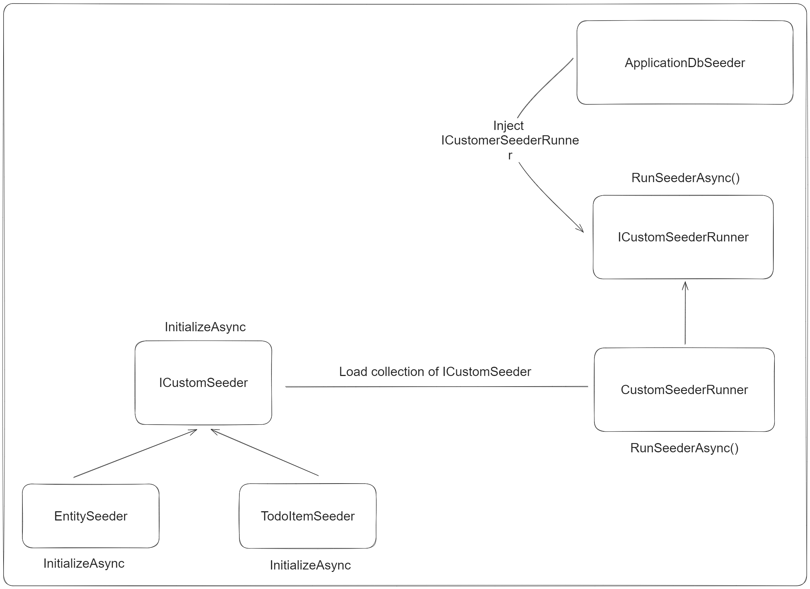

# Persistence Layer Key Notes

This README notes about persistence layer in Clean Architecture. Here are some issues that should be answer in this part:

- What are components placed inside persistence layer?
- How to implement ApplicationDbContext
- How to implement DbInitialization?
- How to implement DbSeeder?

## Persistence Layer Components

Persistence is the outermost layer in Clean Architecture. Its mainly purpose is to connect to database provider (SQL or NoSQL)

Components should live inside this layer:

1. DbContext and DbSet configurations
2. AddDbContext<> and DbContext configurations through DbContextOptionsBuilder
3. DbSeeder
4. DbInitializer
5. AddApiVersioning
6. MapEndpoints

## ApplicationDbContext Configuration Approach

Answer for: How to implement ApplicationDbContext

There are several approaches to config DbContext, two well-known ways are:

1. Place DbSet and Entity configuration in ApplicationDbContext class which implements DbContext, and put inside OnModelCreating() method
2. Seperate each entity, and implements interface IEntityTypeConfiguration<TEntity>

Head to this Github Gist for sample codes:
https://gist.github.com/anacondaf/3ced9bec9607067fe8066acb4b0406f4

## DbInitializer Implementation

Answer for: How to implement DbInitialization?

DbInitialization can be achieved by using MigrateAsync() or Migrate():

```csharp
dbContext.Database.MigrateAsync(CancellationToken cancellationToken)
dbContext.Database.Migrate()
```

Then, we can create a method inside Startup extension method inside Infrastructure layer:

> API/Infrastructure/Startup.cs

```c#
public static class Startup {
    public static IServiceCollection AddInfrastructure(this IServiceCollection services, IConfiguration configuration)
    {
        services
            .AddServices()
            .AddPersistence(configuration)
            .AddApiVersioning()
            .AddScoped<ICustomSeederRunner, CustomSeederRunner>()
            .AddServices(typeof(ICustomSeeder), ServiceLifetime.Transient)
            .AddTransient<ApplicationDbSeeder>()
            .AddTransient<ApplicationDbInitializer>();

        return services;
    }

    public static async Task InitializeDatabasesAsync(this IServiceProvider services, CancellationToken cancellationToken) {
        using var scope = services.CreateScope();

        await scope.ServiceProvider.GetRequiredService<ApplicationDbInitializer>().InitializeAsync(cancellationToken);
    }
}
```

## DbSeeder Implementation

Answer for: How to implement DbSeeder?



- Then refer to AddInfrastructure to register ApplicationDbSeeder, ICustomSeeder, ICustomSeederRunner:

  https://gist.github.com/anacondaf/77bf743059d4e07de991cf27bf065e3d

- Then ApplicationDbInitializer inject ApplicationDbSeeder and ApplicationDbContext to execute Migration and Seeding:

  https://gist.github.com/anacondaf/75199b0c08bb2e5b219e4a35323696e3
